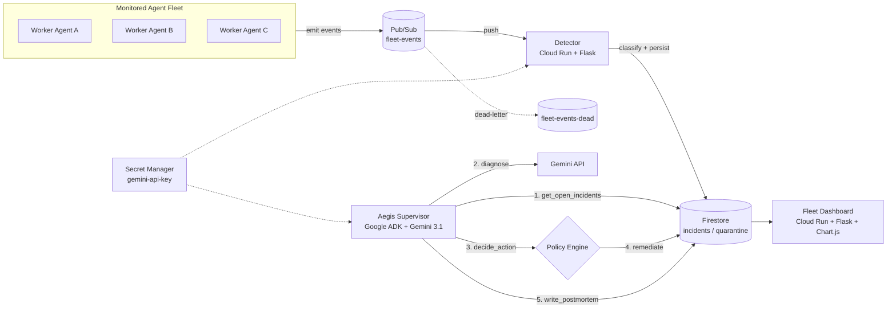
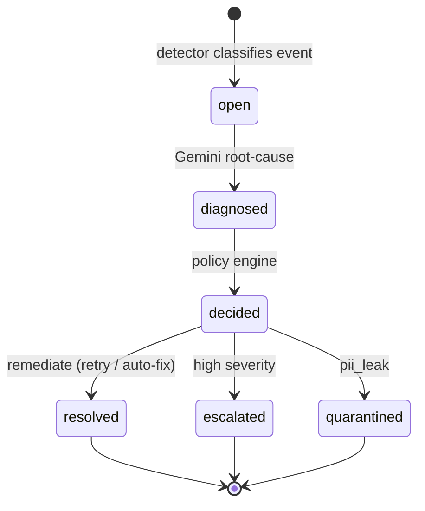
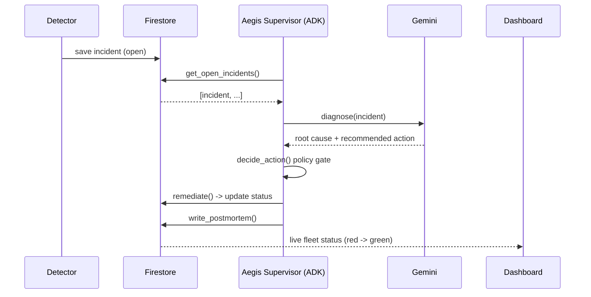

# Aegis — An AI Agent That Supervises AI Agents

> Autonomous supervision for fleets of AI agents. Aegis watches other agents, detects failures, and uses a Gemini-powered [Google ADK](https://google.github.io/adk-docs/) agent to diagnose, decide, remediate, and document — with no human in the loop.

Built for the **All Things Agentic Hackathon** on **Google ADK + Gemini 3.1 Flash Lite + Cloud Run**.

---

## The problem

Teams now run fleets of AI agents in production, but nobody supervises them. When an agent silently fails, burns through its token budget, leaks PII, or returns low-confidence garbage, it usually goes unnoticed until it becomes expensive or dangerous.

## What Aegis does

Aegis is a **supervisor agent**. It ingests events from a fleet of worker agents, classifies incidents, and hands each one to an autonomous ADK reasoning loop that:

1. **Diagnoses** the root cause with Gemini
2. **Decides** an action against a policy (retry, escalate, quarantine, follow recommendation)
3. **Remediates** automatically
4. **Writes a postmortem** and updates a live dashboard
5. **Answers Questions** via a Chatbot Reporting Agent that reads real-time incident logs.

All of this happens in the background, driven by the agent — not by hard-coded scripts.

---

## Architecture



**Flow:** worker agents emit events → Pub/Sub → the **detector** (a Pub/Sub push endpoint) classifies and stores incidents in Firestore → the **Aegis supervisor** (an ADK `LlmAgent` with tools) triages every open incident → the **dashboard** shows the fleet flip red and back to green in real time while a **Reporting Chatbot** allows admins to query incident metrics.

### Incident lifecycle



### Supervisor reasoning loop



---

## Tech stack

| Layer | Technology |
| --- | --- |
| Reasoning agent | Google ADK (`LlmAgent` + tools) |
| LLM | Gemini (`gemini-3.1-flash-lite`) via `google-genai` |
| Event bus | Cloud Pub/Sub |
| State store | Cloud Firestore (Native) |
| Services | Cloud Run (detector + dashboard) |
| Web | Flask, Material Design 3 UI, Chart.js |
| Reliability | Tenacity retries, Pub/Sub dead-letter topic |

---

## Repository layout

```text
aegis/
├─ aegis_supervisor/       # Google ADK agent package
│  ├─ agent.py             # root_agent (LlmAgent)
│  ├─ tools.py             # get_open_incidents, diagnose, decide_action, remediate, write_postmortem
│  └─ __init__.py
├─ dashboard/              # Flask fleet dashboard (Material 3 UI)
├─ scripts/                # reset_data.py, seed_demo.py
├─ tests/                  # pytest unit tests (classify, decide, metrics)
├─ fleet.py                # simulates a healthy agent fleet
├─ trigger.py              # injects a failure (tool | budget | pii)
├─ detector.py             # Pub/Sub push endpoint: classify + persist
├─ diagnoser.py            # Gemini diagnosis helper
├─ decider.py              # policy-based decision engine
├─ remediator.py           # remediation actions
├─ reporter.py             # postmortem writer
├─ Dockerfile
├─ requirements.txt
└─ README.md
```

---

## Getting started

### Prerequisites

- Python 3.12+
- A Google Cloud project with Firestore (Native mode) and Pub/Sub enabled
- A Gemini API key from [Google AI Studio](https://aistudio.google.com/)

### Setup

```bash
git clone https://github.com/maazmdx/aegis-agent.git
cd aegis-agent
python -m venv venv && source venv/bin/activate
pip install -r requirements.txt
```

### Configure environment

Create a `.env` (never commit it):

```bash
export GEMINI_API_KEY="your-key"
export GOOGLE_API_KEY="$GEMINI_API_KEY"   # ADK reads GOOGLE_API_KEY
export PROJECT_ID="your-gcp-project"
export LOCATION="us-central1"
```

### Run locally

```bash
# 1. seed a clean, realistic demo dataset
python scripts/seed_demo.py

# 2. start the detector (with autonomous pipeline enabled)
AEGIS_AUTO_PIPELINE=true python detector.py  # http://localhost:8080

# 3. start the dashboard
PORT=8081 python dashboard/main.py  # http://localhost:8081

# 4. inject a failure; the supervisor triages it asynchronously in the background
# Option A: Click "Simulate Incident" on the dashboard UI at http://localhost:8081
# Option B: Trigger it locally via curl
curl -X POST http://localhost:8081/api/trigger
```

### Test

```bash
pytest tests/ -v
```

---

## Incident model

- **Lifecycle:** `open → diagnosed → decided → resolved / escalated`

| Signal | Classified as | Decision |
| --- | --- | --- |
| tool error | `tool_failure` | retry if safe |
| cost > 1.0 or tokens > 10000 | `budget_exceeded` | escalate if high severity |
| PII detected | `pii_leak` | quarantine |
| confidence < 0.5 | `low_confidence` | follow model's recommended action |

---

## Deployment (Cloud Run)

```bash
# store the key
echo -n "$GEMINI_API_KEY" | gcloud secrets create gemini-api-key --data-file=-

# detector
gcloud run deploy aegis-detector --source . --region us-central1 --allow-unauthenticated \
  --set-secrets GEMINI_API_KEY=gemini-api-key:latest

# dashboard
gcloud run deploy aegis-dashboard --source=dashboard/ --region us-central1 --allow-unauthenticated

# supervisor agent
adk deploy cloud_run --project=$PROJECT_ID --region=us-central1 \
  --service_name=aegis-supervisor aegis_supervisor
```

Wire the detector as a Pub/Sub push subscription with a dead-letter topic for reliability.

---

## License

MIT — see [LICENSE](LICENSE).
