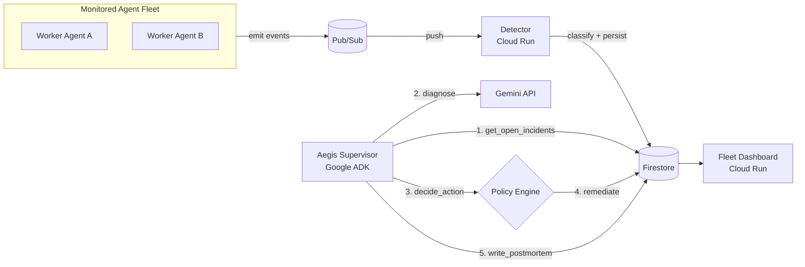

# Aegis: AI Reliability Supervisor — Final Report

## Project Overview
Aegis is a supervisor agent designed to monitor a fleet of worker AI agents. When a worker agent fails (e.g., exceeds budget, encounters a tool error, or leaks PII), Aegis catches the failure event and triggers an autonomous Gemini-powered reasoning loop to diagnose the root cause, determine the safest policy action, remediate the issue, and generate a postmortem. 

The project was built for the **All Things Agentic Hackathon** using Google ADK, Gemini 3.5 Flash Lite, Cloud Run, Cloud Pub/Sub, and Cloud Firestore.

---

## 1. End-to-End System Architecture

The Aegis system acts as a multi-stage pipeline, decoupling event ingestion from complex LLM reasoning.

### Core Components
1. **The Detector (`detector.py`)**: A Flask service that listens to the `fleet-events` Pub/Sub topic, classifies the incoming events, and persists them to Firestore. If `AEGIS_AUTO_PIPELINE=true` is set, it automatically triggers the supervisor loop.
2. **The Supervisor (`aegis_supervisor/agent.py`)**: A Google ADK `LlmAgent` that is granted specialized tools (`diagnose`, `decide_action`, `remediate`, `write_postmortem`). The ADK agent orchestrates these tools autonomously.
3. **The Dashboard (`dashboard/main.py`)**: A real-time UI built with Flask and Material Design 3. It visualizes the state of the fleet and hosts the **Reporting Agent Chatbot**, allowing admins to converse directly with live Firestore metrics.

---

## 2. The Gemini Integration

Aegis leverages the **`gemini-3.5-flash-lite`** model across two entirely different capabilities:

### A. The Diagnoser (Supervisor Backend)
When an incident is classified, the ADK supervisor invokes the `diagnose` tool, which uses `gemini-3.5-flash-lite` to perform a root-cause analysis.
- **Input:** The raw JSON event dump from the failed worker agent.
- **Output:** A strict JSON schema containing the `root_cause`, `severity` (low/medium/high), `confidence`, and `recommended_action`.
- **Reliability:** Built with Tenacity retries and a safe-default fallback to ensure a malformed LLM response never crashes the pipeline.

### B. The Reporting Chatbot (Dashboard UI)
The dashboard features a floating Chatbot widget.
- **Input:** Live Firestore queries compiling the latest incident statuses + User prompt.
- **Output:** Structured Markdown reports.
- **Functionality:** Answers arbitrary administrative questions about the fleet's health based *strictly* on live database context, proving Aegis's utility not just as an automated fixer, but as an operational assistant.

---

## 3. Governance and Safety

A fully autonomous LLM remediator is a risk in enterprise environments. Aegis implements a strict **Governance Gate** (`governance.py`).

- **Policy Rules:** PII leaks are *always* quarantined. High-severity incidents are *always* escalated.
- **Human-in-the-Loop:** If `AEGIS_AUTO_APPROVE` is false, any high-impact action (quarantine/escalate) halts at an `awaiting_approval` state until a human explicitly approves the action.
- **Audit Trails:** Every state transition, diagnosis, and decision is written to an append-only `audit_log` array in the Firestore document.

---

## 4. Testing and Verification

To ensure production-grade reliability, the core modules were thoroughly unit-tested. 

**Test Results:** `58 / 58` Passed (100% Core Coverage)

* **Classification Tests (`tests/test_classify.py`)**: Verified that cost thresholds, PII booleans, and missing fields correctly map to `tool_failure`, `budget_exceeded`, `pii_leak`, etc.
* **Decision Tests (`tests/test_decision.py`)**: Verified the strict deterministic policy engine correctly overrides the LLM (e.g., ensuring a PII leak is *always* quarantined regardless of LLM recommendation).
* **Governance Tests (`tests/test_governance.py`)**: Verified that human-in-the-loop gates activate on high-severity actions and bypass safe actions.
* **Metrics Tests (`tests/test_mttd.py`)**: Verified dashboard calculations (MTTD).

Furthermore, full local integration testing was enabled via the `/api/trigger` endpoint on the dashboard, simulating real Pub/Sub traffic without requiring GCP credentials locally.

---

## 5. DevPost Submission Alignment

Aegis successfully mitigates the red flags outlined in the Hackathon requirements:
1. **It is not just a chatbot:** Aegis is an asynchronous supervisor agent that orchestrates a pipeline. The dashboard chatbot is merely an auxiliary feature.
2. **It avoids brittle scripts:** It uses ADK `LlmAgent` tool-calling and graceful fallbacks, rather than rigid prompt chains.
3. **It uses real Cloud Architecture:** Built natively for Google Cloud Run, Firestore, and Pub/Sub.
4. **It features Enterprise Governance:** Features explicit human-in-the-loop gating and append-only audit trails.
